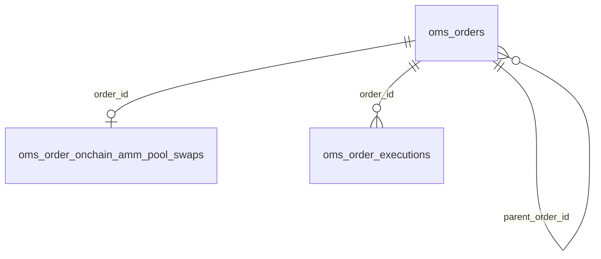

# OMS — MySQL Storeとレビュー済み3テーブルのDDL

2026-09-20。[schema.proposed.sql](schema.proposed.sql) にユーザーレビュー済みの構成を統合。
ファイル名は従来の参照を維持。本番migrationではなく、既存DBへは未適用。
以前の戦略root案・8テーブル案はこの内容で置き換えた。

## 構成

| テーブル | 行の意味 |
| --- | --- |
| oms_orders | 注文の現在状態。累積約定量、指値/TP/SL、親注文との関連を含む |
| oms_order_onchain_amm_pool_swaps | 注文に1対1で紐付くAMM Pool Swapの詳細 |
| oms_order_executions | Prepare・送信・個別約定などの実行記録1件 |



strategy、balance、position、conditions、relations、fills、eventsの独立テーブルは作らない。
OpenとCloseは別注文。Close.parent_order_idがOpenを指す。Closeは任意。

## oms_orders

- 内部IDはBIGINT UNSIGNED / Go uint64。storage既存ID Generatorで採番する。
- account_idはK4K3RU所有者、account_refは実行口座/walletの論理参照。
- asset_classはcrypto/fx/stock等、domainはドメイン専用テーブルの判別用。
  `onchain-amm-pool` は `oms_order_onchain_amm_pool_swaps` に固定対応する。
  テーブル名を外部入力から動的生成しない。
- symbolは表示/検索用。厳密な銘柄識別はドメイン側に置く。
- sideとorder_typeは売買方向/発注方式。TP/SLは注文を発動する条件であり、種類とは別。
- quantityとfilled_quantityは同じ単位。Closeの数量確定前はquantity=NULL。
- TP/SLのtypeはprice/return_bps。typeとvalueは両方NULLか両方設定。
  条件式の値の意味・価格単位・原価参照元はドメインで定義する。
- (account_id,idempotency_key)の重複は内容に関係なく拒否する。
  通信断後の確認用に、`SelectOrderByIdempotencyKey`で同じ組による既存注文取得を提供する。
- request_snapshot/request_digest/schema_version/revisionは置かない。
- expires_atは注文の期限、completed_atは終端状態への遷移時刻。

## oms_order_onchain_amm_pool_swaps

order_idを主キー兼FKとし、別のIDは付けない。venueは親を参照する。
初期対応はAMM Pool直接指定のSwap。アグリゲータの複数Poolルートは対象外。
EVMはPoolコントラクト/Token address、SolanaはPool account/Mint、SuiはPool object/Coin Typeを
識別するためのカラムであり、DDLだけで各チェーンの実行対応を追加するものではない。
Solanaのrecipientは受取人walletとして扱い、Token Accountは実行時に解決する案。

Exact Inputなら親のquantity/filled_quantityは入力Token単位、Exact Outputなら出力Token単位。
counter_quantityは反対側の実数量。この関係は約定記録にも適用する。
NewPairの初期Open/CloseではExact Inputを利用する。
execution_ttl_msは個々のPrepareの有効期間で、親注文のexpires_atとは別。
Signerは公開アドレスのみ。秘密鍵・資格情報は保存しない。

## oms_order_executions — 統合型

1行を実行試行全体ではなく、実行過程の記録1件とする。
(order_id,attempt_number)で同じ試行をまとめ、exec_typeで段階を区別する。

| attempt_number | exec_type | purpose | status | quantity |
| --- | --- | --- | --- | --- |
| 1 | prepared | approval | succeeded | NULL |
| 1 | submitted | approval | succeeded | NULL |
| 2 | prepared | trade | succeeded | NULL |
| 2 | submitted | trade | pending | NULL |
| 2 | filled | trade | succeeded | 30 |
| 2 | filled | trade | succeeded | 20 |

この場合、親注文の累積約定量は50。Approvalは累積に含めない。
prepared成功は準備完了、submitted成功は実行先での完了確認、filled成功は有効な個別約定。
準備/送信の失敗も該当段階のstatus=failedで記録する。

- record_keyは注文内の安定した記録識別子。段階記録は試行と段階、約定は提供元約定ID等で
  区別する。受信ごとに乱数キーを作らない。約定再配信は新しい約定として加算しない。
- 同じ外部約定が試行番号を変えて再配信されても、同じrecord_keyへ正規化する。
- execution_idは複数段階/部分約定に共通なのでUNIQUEにしない。
- source_versionは提供元に単調な改訂番号があるときのみ利用する。
  番号がないとき、受信順だけで上書きせず、提供元照会等で整合を確認する。
- 約定訂正は該当記録を更新、取消/reorgはreversedに更新して数量を保持する。
  訂正前の全履歴は保存しない。原始通知を全件保管するイベントログではない。
- expires_atはpreparedにだけ設定できる。実行詳細のNonce/Gas/署名payload等は既存の
  TradeHub Executionを参照し、このDDLではその移行/複製を行わない。

## 同一トランザクションで行う更新

1. 親注文をSELECT ... FOR UPDATEでロックする。
2. 外部記録の重複/改訂順を確認し、実行記録を追加または更新する。
3. 有効なfilled（purpose=trade、status=succeeded）だけから累積値を任意精度で計算する。
4. 親のfilled_quantity/statusを更新してcommitする。

約定情報のないApproval成功/送信成功をfilledに変換しない。
複数注文を更新する場合は固定ID順にロックする。RPC待機中はDBロックを保持しない。
DBトリガーによる自動集計は設けない。Storeは親ロックと更新前状態の照合を行う。
TradeHubが集計値と状態を決定し、実行記録と親状態を同じトランザクションで更新する。

## DDL制約と、Store/ドメイン層の責務

DDLで保証するもの:

- 注文作成キーと実行record_keyの重複禁止
- 親注文/Swap子/実行記録の参照先の存在と削除制限
- Swap子の1対1、swap_kind、Slippage上限、正のTTL
- TP/SLのtype/valueのNULL対応とtypeの許可値
- 正のattempt_number、filledだけの数量必須・approval約定禁止、preparedだけの期限

Storeで保証するもの:

- 全取得・更新のaccountスコープ、親子注文の同一account、自己参照禁止
- 親IDは作成時のみ設定し、既存親を要求することでStore経由の循環参照を防止
- AMM注文のdomainと専用子レコードの整合、呼出元トランザクション内での同時作成
- 数量/価格文字列の正規化と正値/非負値、最大384文字
- TPのreturn_bpsは正整数、SLは-10000以上の負整数、priceは正値
- 注文status、exec_type、purpose、実行statusの許可値
- 親ロック、更新前状態との不一致によるErrConflict、重複キーによるErrDuplicate

TradeHubで判断するもの:

- 注文種別・方向の意味、状態遷移、段階間の整合、終端時刻
- Open/Closeのドメイン・資産対応、オンチェーン識別子の有効性
- 外部Executionの所有者と存在、別注文/別試行への誤った重複紐付け防止
- 累積約定量更新、Close量算出、再送可否、提供元の改訂順照合

注文statusはpending / processing / partially_filled / filled / canceled / expired / failed / rejected。
実行statusはpending / succeeded / failed / reversed / rejected。
Storeは`rejected`を保存・取得できるが、拒否と判定する条件はTradeHubに置く。

カラム/制約は承認済みDDLを維持し、未承認の制約や追加テーブルを導入しない。
数量はASCII VARCHAR(384)の10進文字列で、FLOAT/DOUBLEやSQLの暗黙数値変換を使わない。
日時はUTC DATETIME(6)。残高・資金予約・TP/SL監視処理・公開APIは今回の実装対象外。

## Go Store

既存storageと同様、StoreはDB接続を所有せず、取得には`api.Executor`、
変更には呼出元の`*sql.Tx`を受け取る。`NewDefaultStore`または`NewStore`で構成する。
MySQL接続は`parseTime=true&loc=UTC`を指定し、DBセッションもUTCで運用する。
日時はUTC・マイクロ秒精度で保存する。

| 操作 | メソッド |
| --- | --- |
| 注文とAMM詳細の作成 | InsertOnchainAMMPoolOrder |
| 注文取得・ロック | SelectOrder / SelectOrderForUpdate |
| 作成キーでの確認 | SelectOrderByIdempotencyKey |
| AMM詳細取得 | SelectOnchainAMMPoolSwap |
| 段階・個別約定記録の追加 | InsertExecution |
| 実行記録取得・ロック | SelectExecutionByKey / SelectExecutionForUpdate |
| 実行記録のID順ページ取得 | ListExecutions |
| 注文/実行の状態更新 | UpdateOrderState / UpdateExecutionState |

作成時のID=0は自動採番。既存IDを指定することも可能。
変更メソッドはcommitしない。エラー時は呼出元がトランザクション全体をrollbackする。
更新は読み取ったStateをexpected、TradeHubが計算した値をnextとして渡す。
`errors.Is`でErrDuplicate / ErrConflict / ErrInvalidParameter / sql.ErrNoRowsを判別できる。

部分約定の集計は、同じトランザクションで先に親をロックし、
`ListExecutions`の全ページを取得してからTradeHubで計算する。
ページ上限は200。最後のIDをafterIDに渡し、空ページまで取得する。
トランザクション外の複数ページに一貫したスナップショットは保証しない。

`CreateTables`は初期DDLの明示適用用で、既存テーブルへの再適用や変更migrationではない。
MySQLのDDLはトランザクションでrollbackできないため、通常の注文処理から呼ばない。

## 再現可能な検証

```sh
# storageリポジトリで実行。Dockerとローカルのmysql:8.4イメージが必要。
python3 go/mysql/oms/verify_schema.py
python3 go/mysql/oms/verify_store.py

# Goモジュール単独の検証
cd go/mysql/oms
GOWORK=off go test ./...
GOWORK=off go vet ./...
GOWORK=off go build ./...
```

Pythonランナーは標準ライブラリのみを使用。一意名・データtmpfsの一時MySQLを作り、
検証後は削除する。既存DB・volume・サービスへ接続しない。
DDL検証はnetwork=none、Go Store検証はランダムなlocalhostポートで接続する。

DDL検証は外部キー、重複キー、TP/SLのNULL整合、Swap条件、部分約定、取消、rollbackを確認する。
Store検証は`go test -race -count=1 -v ./...`で、実DBへの保存/取得、account分離、
部分約定と訂正の一括更新、重複配信、状態競合、並行作成、ロック待ちのキャンセルを確認する。
通常の`go test`では、`K4K3RU_OMS_TEST_DSN`が未指定の場合にMySQLテストをskipする。

TradeHubへの組み込み、公開API、Agent E2E、本番migrationへの登録は別工程。
commit、pushは未実施。
